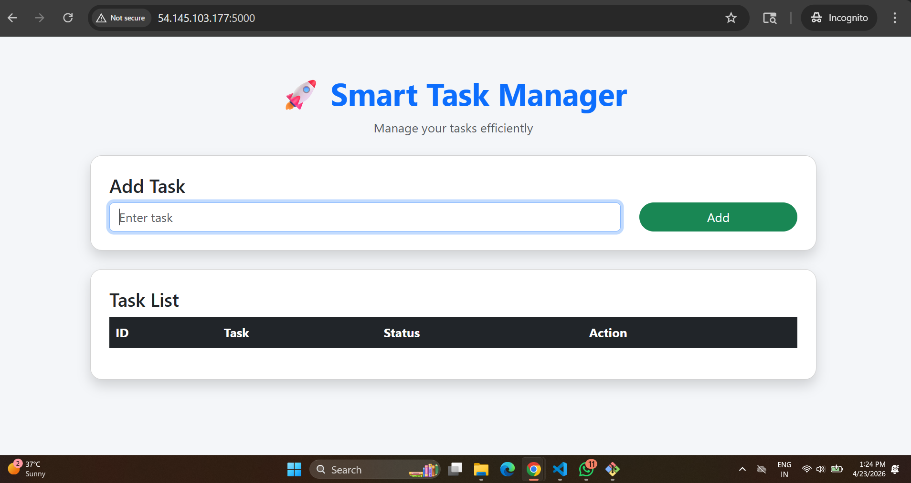
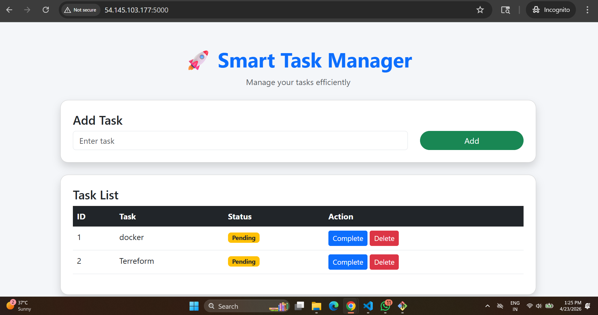
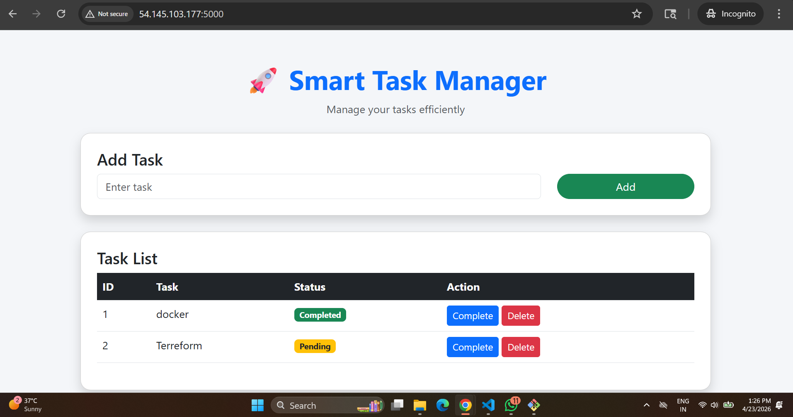

# 🚀 Smart Task Manager — Containerized 2-Tier Application

<p align="center">


</p>

---

## 📌 Overview

**Smart Task Manager** is a **production-ready, containerized 2-tier web application** built with **Flask and MySQL**, designed to demonstrate real-world **DevOps practices**, including container orchestration, service communication, and cloud deployment.

This project simulates a typical enterprise setup where a web application interacts with a backend database through a structured architecture.

---

## 🏗️ Architecture

```text
             ┌───────────────┐
             │     Client    │
             │   (Browser)   │
             └──────┬────────┘
                    │ HTTP (Port 5000)
                    ▼
        ┌──────────────────────────────┐
        │   Flask Application Layer    │
        │   (Docker Container)         │
        └─────────────┬────────────────┘
                      │ Internal Network
                      ▼
        ┌──────────────────────────────┐
        │     MySQL Database Layer     │
        │     (Docker Container)       │
        └──────────────────────────────┘

        🐳 Docker Compose Managed Network
```

---

## ⚙️ Technology Stack

| Layer            | Technology      |
| ---------------- | --------------- |
| Application      | Flask (Python)  |
| Database         | MySQL 5.7       |
| Containerization | Docker          |
| Orchestration    | Docker Compose  |
| Frontend         | HTML, Bootstrap |
| Cloud Platform   | AWS EC2         |

---

## 📁 Project Structure

```bash
smart-task-manager/
│
├── app.py                  # Flask application logic
├── requirements.txt       # Python dependencies
├── Dockerfile             # Application container definition
├── docker-compose.yml     # Multi-container orchestration
└── templates/
    └── index.html         # UI template
```

---

## 🔧 Key Features

* Full **CRUD functionality** (Create, Read, Update, Delete)
* **Containerized architecture** using Docker
* **Multi-container orchestration** via Docker Compose
* **Service-to-service communication** using internal networking
* **Persistent storage** with Docker volumes
* Clean and responsive UI

---

## 🚀 Getting Started

### 🔹 Prerequisites

* Docker installed
* Docker Compose installed

---

### 🔹 Installation & Run

```bash
# Clone repository
git clone https://github.com/your-username/smart-task-manager.git
cd smart-task-manager

# Build and start services
docker-compose up --build -d
```

---

### 🔹 Access Application

```text
http://localhost:5000
```

---

## ☁️ Deployment on AWS EC2

```bash
# Connect to EC2
ssh -i your-key.pem ec2-user@<EC2-IP>

# Install Docker
sudo yum install docker -y
sudo service docker start
sudo usermod -aG docker ec2-user

# Clone repository
git clone https://github.com/your-username/smart-task-manager.git
cd smart-task-manager

# Run application
docker-compose up -d --build
```

### 🌐 Access:

```text
http://<EC2-PUBLIC-IP>:5000
```

---
## 📸 Application Output

### 🔷 Home Page (Add Task)



---

### 🔷 Task List (Pending Tasks)



---

### 🔷 Task Completion Status




## 🔍 Application Workflow

1. User submits a task via UI
2. Flask processes the request
3. Data is stored in MySQL
4. Updated data is rendered dynamically

---

## 📈 Future Enhancements

* 🔐 User Authentication & Authorization
* 🌐 Custom Domain & HTTPS (SSL)
* ⚖️ Load Balancing (3-tier architecture)
* 🔄 CI/CD Pipeline (GitHub Actions / Jenkins)
* ☸️ Kubernetes Deployment

---

## 💼 Professional Summary (Resume Use)

> Designed and deployed a containerized 2-tier web application using Flask and MySQL. Implemented Docker Compose for multi-container orchestration and deployed the solution on AWS EC2 with persistent storage.

---

👨‍💻 Author

Shubham Tippe Cloud & DevOps Learner

GitHub  
https://github.com/shubhamtippe9


linkedin  
https://www.linkedin.com/in/shubhamtippe9

📜 License

This project is for educational and learning purposes.
---
